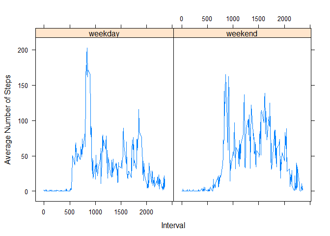

Read the data
=============

    rm(list=ls())
    am<- read.csv(file.choose(), header = TRUE)
    head(am,5)

    ##   steps       date interval
    ## 1    NA 2012-10-01        0
    ## 2    NA 2012-10-01        5
    ## 3    NA 2012-10-01       10
    ## 4    NA 2012-10-01       15
    ## 5    NA 2012-10-01       20

Total Missing values
====================

    library(mice)

    ## Loading required package: lattice

    md.pattern(am) #2304 missing values in steps

    ##       date interval steps     
    ## 15264    1        1     1    0
    ##  2304    1        1     0    1
    ##          0        0  2304 2304

    colSums(is.na(am))

    ##    steps     date interval 
    ##     2304        0        0

Summary and structure of data set
=================================

    summary(am)

    ##      steps                date          interval     
    ##  Min.   :  0.00   2012-10-01:  288   Min.   :   0.0  
    ##  1st Qu.:  0.00   2012-10-02:  288   1st Qu.: 588.8  
    ##  Median :  0.00   2012-10-03:  288   Median :1177.5  
    ##  Mean   : 37.38   2012-10-04:  288   Mean   :1177.5  
    ##  3rd Qu.: 12.00   2012-10-05:  288   3rd Qu.:1766.2  
    ##  Max.   :806.00   2012-10-06:  288   Max.   :2355.0  
    ##  NA's   :2304     (Other)   :15840

    str(am) #Date is in factor format

    ## 'data.frame':    17568 obs. of  3 variables:
    ##  $ steps   : int  NA NA NA NA NA NA NA NA NA NA ...
    ##  $ date    : Factor w/ 61 levels "2012-10-01","2012-10-02",..: 1 1 1 1 1 1 1 1 1 1 ...
    ##  $ interval: int  0 5 10 15 20 25 30 35 40 45 ...

    am$date<-as.Date(am$date)

Calculate total number of steps each day
========================================

    dailystepsmissing<-as.data.frame.table(tapply(am$steps, format(am$date, '%Y-%m-%d'), sum))
    str(dailystepsmissing) #Convert date to date class

    ## 'data.frame':    61 obs. of  2 variables:
    ##  $ Var1: Factor w/ 61 levels "2012-10-01","2012-10-02",..: 1 2 3 4 5 6 7 8 9 10 ...
    ##  $ Freq: int  NA 126 11352 12116 13294 15420 11015 NA 12811 9900 ...

    dailystepsmissing$Var1<-as.Date(dailystepsmissing$Var1)

Histogram of total number of steps each day
===========================================

    library(ggplot2)
    ggplot(dailystepsmissing, aes(x=Var1, y=Freq))+geom_histogram(stat="identity", fill="salmon")

Average/Mean number of steps taken each day
===========================================

    library(dplyr)

    ## 
    ## Attaching package: 'dplyr'

    ## The following objects are masked from 'package:stats':
    ## 
    ##     filter, lag

    ## The following objects are masked from 'package:base':
    ## 
    ##     intersect, setdiff, setequal, union

    mean_steps<- as.data.frame( am %>% group_by(date) %>% summarise(mean(steps)))
    head(mean_steps,10)

    ##          date mean(steps)
    ## 1  2012-10-01          NA
    ## 2  2012-10-02     0.43750
    ## 3  2012-10-03    39.41667
    ## 4  2012-10-04    42.06944
    ## 5  2012-10-05    46.15972
    ## 6  2012-10-06    53.54167
    ## 7  2012-10-07    38.24653
    ## 8  2012-10-08          NA
    ## 9  2012-10-09    44.48264
    ## 10 2012-10-10    34.37500

Median steps taken each day
===========================

    median_steps<- as.data.frame( am %>% group_by(date) %>% summarise(median(steps,na.rm = FALSE)))
    head(median_steps,10)

    ##          date median(steps, na.rm = FALSE)
    ## 1  2012-10-01                           NA
    ## 2  2012-10-02                            0
    ## 3  2012-10-03                            0
    ## 4  2012-10-04                            0
    ## 5  2012-10-05                            0
    ## 6  2012-10-06                            0
    ## 7  2012-10-07                            0
    ## 8  2012-10-08                           NA
    ## 9  2012-10-09                            0
    ## 10 2012-10-10                            0

Time Series plot of total number of steps without imputing Missing Values
=========================================================================

    library(ggplot2)
    ggplot(dailystepsmissing, aes(Var1, Freq)) + geom_line()+ xlab("Date") + ylab("Daily Steps")

5 minute interval that contains maximum number of steps each day
================================================================

Use aggregate to create new data frame with the maxima
======================================================

    am_agg <- aggregate(steps ~ date, am, max)
    # then simply merge with the original
    am_max <- merge(am_agg, am)
    head(am_max,10)

    ##          date steps interval
    ## 1  2012-10-02   117     2210
    ## 2  2012-10-03   613      620
    ## 3  2012-10-04   547     1815
    ## 4  2012-10-05   555     1210
    ## 5  2012-10-06   526     1840
    ## 6  2012-10-07   523     1710
    ## 7  2012-10-09   748      810
    ## 8  2012-10-10   413     1205
    ## 9  2012-10-11   748      825
    ## 10 2012-10-12   802      900

Using mice package to impute missings
=====================================

Mice package is a machine learning package which will consider other numeric features to impute
===============================================================================================

the missing package
===================

    am1<-am[,c(1,3)]
    set.seed(123)
    index1<- sample(2, nrow(am1), replace= T, prob = c(0.7,0.3))
    library(mice)
    init <- mice(am1, maxit=0) 
    meth <- init$method
    predM <- init$predictorMatrix
    set.seed(100)
    imputed = mice(am1, method=meth, predictorMatrix=predM, m=5)

    ## 
    ##  iter imp variable
    ##   1   1  steps
    ##   1   2  steps
    ##   1   3  steps
    ##   1   4  steps
    ##   1   5  steps
    ##   2   1  steps
    ##   2   2  steps
    ##   2   3  steps
    ##   2   4  steps
    ##   2   5  steps
    ##   3   1  steps
    ##   3   2  steps
    ##   3   3  steps
    ##   3   4  steps
    ##   3   5  steps
    ##   4   1  steps
    ##   4   2  steps
    ##   4   3  steps
    ##   4   4  steps
    ##   4   5  steps
    ##   5   1  steps
    ##   5   2  steps
    ##   5   3  steps
    ##   5   4  steps
    ##   5   5  steps

    imputed <- complete(imputed)
    sapply(imputed, function(x) sum(is.na(x)))

    ##    steps interval 
    ##        0        0

    am_new<-am
    am_new$steps<-imputed$steps
    summary(am_new)

    ##      steps             date               interval     
    ##  Min.   :  0.00   Min.   :2012-10-01   Min.   :   0.0  
    ##  1st Qu.:  0.00   1st Qu.:2012-10-16   1st Qu.: 588.8  
    ##  Median :  0.00   Median :2012-10-31   Median :1177.5  
    ##  Mean   : 37.08   Mean   :2012-10-31   Mean   :1177.5  
    ##  3rd Qu.: 13.00   3rd Qu.:2012-11-15   3rd Qu.:1766.2  
    ##  Max.   :806.00   Max.   :2012-11-30   Max.   :2355.0

Calculate total number of steps each day
========================================

    dailysteps<-as.data.frame.table(tapply(am$steps, format(am$date, '%Y-%m-%d'), sum))
    str(dailysteps) #Convert date to date class

    ## 'data.frame':    61 obs. of  2 variables:
    ##  $ Var1: Factor w/ 61 levels "2012-10-01","2012-10-02",..: 1 2 3 4 5 6 7 8 9 10 ...
    ##  $ Freq: int  NA 126 11352 12116 13294 15420 11015 NA 12811 9900 ...

    dailysteps$Var1<-as.Date(dailysteps$Var1)

Histogram using ggplot
======================

    library(ggplot2)
    ggplot(dailysteps, aes(x = dailysteps$Var1, y = dailysteps$Freq)) +
      geom_bar(stat = "identity", fill = "salmon")+ xlab('Date')+ylab('Number of steps')

Panel Plot containing average number of steps taken per 5-minute interval across weekdays and weekends
======================================================================================================

Create a function to separate weekedays and weekends
====================================================

    separation <- function(date) {
      if (weekdays(as.Date(date)) %in% c("Saturday", "Sunday")) {
        "weekend"
      } else {
        "weekday"
      }
    }
    am_new$wday <- as.factor(sapply(am_new$date, FUN=separation))
    str(am_new)

    ## 'data.frame':    17568 obs. of  4 variables:
    ##  $ steps   : int  0 0 47 10 0 0 0 0 0 0 ...
    ##  $ date    : Date, format: "2012-10-01" "2012-10-01" ...
    ##  $ interval: int  0 5 10 15 20 25 30 35 40 45 ...
    ##  $ wday    : Factor w/ 2 levels "weekday","weekend": 1 1 1 1 1 1 1 1 1 1 ...

Panel Plot containing average number of steps taken per 5-minute interval across weekdays and weekends
======================================================================================================

    am_new1 <- aggregate(am_new$steps, by=list(am_new$interval, am_new$wday),mean)
    names(am_new1) <- c("interval", "wday", "steps")
    xyplot(steps ~ interval | wday, am_new1, type = "l", layout = c(2,1),
           xlab = "Interval", ylab = "Average Number of Steps")

